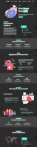

# Covid-19 Landing Page

This project is a landing page for covid-19 :mask: and the template is taken from [this design][template].

This is for the final project of the university internet engineering course!

# Deployment

This project is deployed on [surge.sh](https://surge.sh/).

[Here](http://covid19-landing-page.surge.sh/) is the link.

# Screenshots

This Project is available in dark and light
> click on images for a high resolution one.

Dark:

Light:

# Licenses

- [Template][template] by [DiaShy
](https://dribbble.com/shima-design).

- [Google Fonts](https://fonts.google.com/).
- [GSAP](https://greensock.com/) for animation.
- Light/dark icon by [Font Awesome](https://fontawesome.com/).

[template]: https://dribbble.com/shots/10872612-FREE-psd-Coronavirus-COVID-19-Prevention-Informatics-PSD?utm_source=Clipboard_Shot&utm_campaign=shima-design&utm_content=FREE%20psd%20-%20Coronavirus%20(COVID-19)%20Prevention%20%26%20Informatics%20PSD&utm_medium=Social_Share